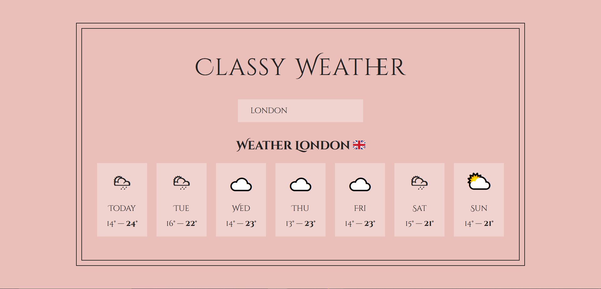
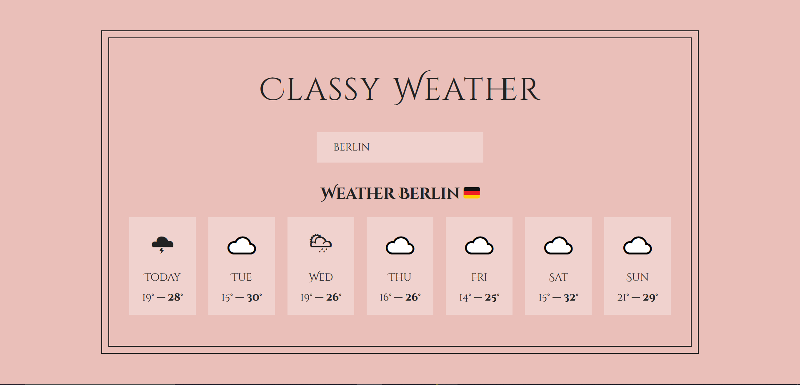
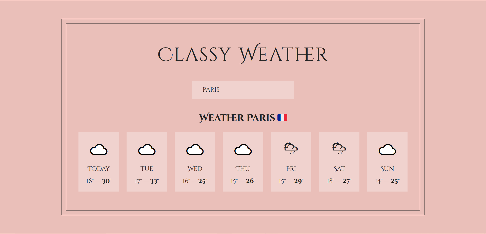
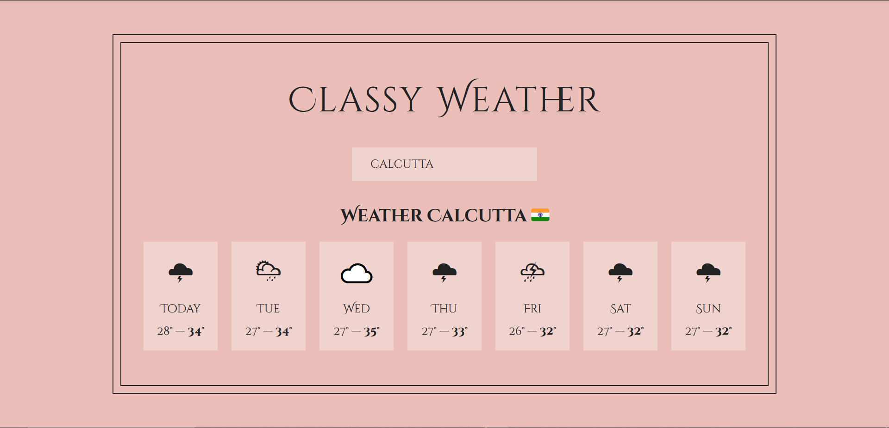
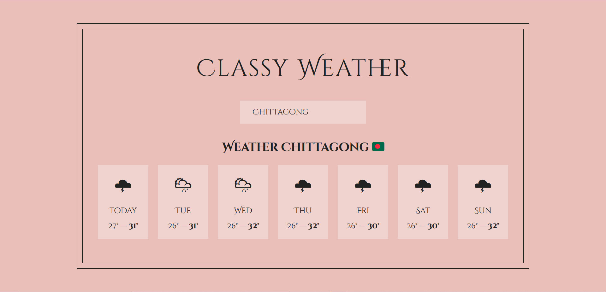
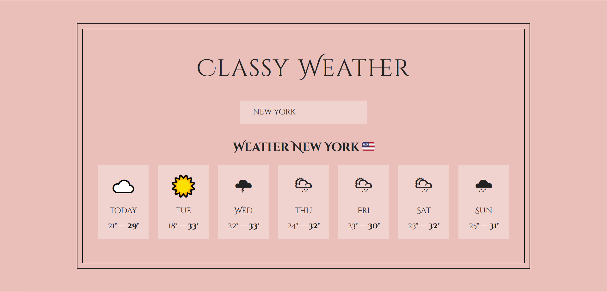

# Classy Weather 🌤️

Classy Weather is a sleek and user-friendly weather application that allows users to search for weather forecasts by location. Simply enter a location in the search bar (e.g., "London"), and the app will display the weather forecast for today and the next six days. The data is fetched in real-time from a reliable weather API, ensuring that users have the most accurate and up-to-date information.

## Project Functionality

- **Location Search:** Users can search for any location worldwide using the search bar.
- **Weather Forecast:** The app displays the weather forecast for the current day and the following six days.
- **Real-time Data:** The weather data is fetched from the Open-Meteo API, ensuring accurate and current information.
- **Responsive Design:** The application is fully responsive, making it accessible on various devices, including smartphones, tablets, and desktops.

## Screenshots

1. **Home Page:**
   
2. **Weather Data for 'London':**
   
3. **Weather Data for 'Berlin':**
   
4. **Weather Data for 'Paris':**
   
5. **Weather Data for 'Calcutta':**
   
6. **Weather Data for 'Chittagong':**
   
7. **Weather Data for 'New York':**
   

## Technology Stack

This project was built using the following technologies:

-  **Create React App**
-  **React 18**
-  **Weather API: [api.open-meteo.com](https://api.open-meteo.com/)**

## Getting Started

### Prerequisites

Ensure you have the following installed on your development machine:

- Node.js (v14 or higher)
- npm or yarn

### Installation

1. **Clone the repository:**

   ```bash
   git clone https://github.com/yourusername/classy-weather.git
   cd classy-weather
   ```

2. **Install the dependencies:**

   If you're using npm:

   ```bash
   npm install
   ```

   If you're using yarn:

   ```bash
   yarn install
   ```

3. **Start the development server:**

   If you're using npm:

   ```bash
   npm start
   ```

   If you're using yarn:

   ```bash
   yarn start
   ```

   The app should now be running on `http://localhost:3000`.

### Deployment

To create a production build of the app, run:

```bash
npm run build
```

or

```bash
yarn build
```

The build folder can then be deployed to any static site hosting service like Netlify, Vercel, or GitHub Pages.

## Contact

For any inquiries or further information, feel free to reach out:

- 📧 **Email**: [hello@paulanik.com](mailto:hello@paulanik.com)
- 🌐 **Portfolio**: [paulanik.com](https://paulanik.com)
- 💼 **LinkedIn**: [LinkedIn Profile](https://www.linkedin.com/in/anik-paul-dev/)
- 📝 **Dev.to**: [Dev.to Profile](https://dev.to/anikpaul)
